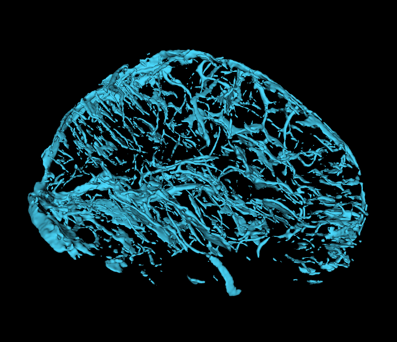
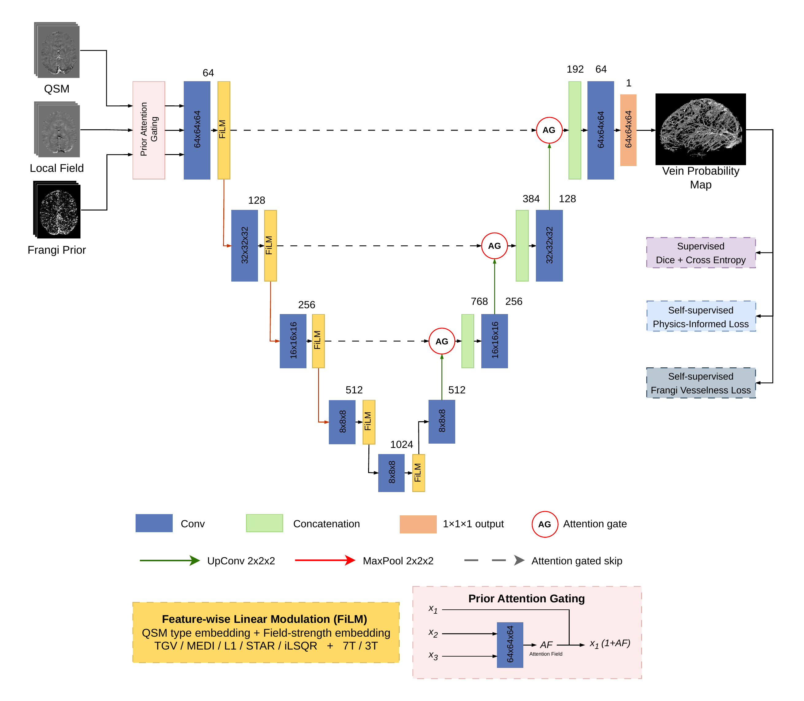

<p align="center">
  
</p>

<h1 align="center">VeinSeg</h1>
<p align="center">
  Physics-informed deep learning for cerebral vein segmentation from QSM
</p>

<p align="center">
  <a href="https://huggingface.co/YousifKhoury/VeinSeg"></a>
  <a href="LICENSE"></a>
  <a href="https://www.python.org/"></a>
</p>

---

## Overview

VeinSeg is a 3D deep learning tool for automatic segmentation of cerebral veins from Quantitative Susceptibility Mapping (QSM). It is trained on multi-site, multi-field-strength data (3T and 7T) across five QSM reconstruction methods (TGV, MEDI, L1, STAR, iLSQR) and uses a physics-informed training objective combining:

- **Supervised** Dice + Cross-Entropy loss
- **Self-supervised** physics-informed dipole field consistency loss
- **Self-supervised** Frangi vesselness shape loss

## Model Architecture

<p align="center">
  
</p>

The model is a 3D attention U-Net with two key components:

**Prior Attention Gating** — the QSM image is gated by the local field and Frangi prior channels before encoding, allowing the network to focus on regions with high vesselness response.

**Feature-wise Linear Modulation (FiLM)** — domain embeddings for QSM reconstruction method (TGV / MEDI / L1 / STAR / iLSQR) and field strength (7T / 3T) condition every encoder stage via learned scale and shift, enabling the same model to generalise across acquisition protocols without retraining.

### Inputs

| Channel | Content | Units |
|---|---|---|
| 0 | QSM susceptibility map | ppm |
| 1 | Local field (measured or dipole-computed from QSM) | ppm |
| 2 | Frangi vesselness prior | [0, 1] |

### Output
- Binary vein mask (argmax)
- Vein probability map (softmax)

---

## Installation

VeinSeg requires PyTorch. Install your preferred version first (see [pytorch.org](https://pytorch.org) for CUDA-specific instructions), then:

```bash
pip install veinseg
```

Download the model weights (run once only):

```bash
veinseg-install /path/to/models/dir
```

The checkpoint is downloaded from [Hugging Face](https://huggingface.co/YousifKhoury/VeinSeg) and the path is saved automatically. You can also set the model path manually using:

```bash
export VEINSEG_CHECKPOINT=/models/veinseg/checkpoint.pth
```

---

## Usage

```bash
veinseg -i qsm.nii.gz -r tgv -f 7t -o mask.nii.gz -p prob.nii.gz
```

### Required arguments

| Flag | Description |
|---|---|
| `-i` | QSM susceptibility map (`.nii` / `.nii.gz`, ppm) |
| `-r` | QSM reconstruction method: `tgv` \| `medi` \| `l1` \| `star` \| `ilsqr` |
| `-f` | MRI field strength: `7t` \| `3t` |
| `-o` | Output binary vein mask |
| `-p` | Output vein probability map |

### Optional arguments

| Flag | Default | Description |
|---|---|---|
| `--local-field PATH` | — | Measured background-removed local field instead of dipole-computed. Accepts Hz or ppm (auto-detected). |
| `--local-field-units` | `auto` | Force units: `hz` \| `ppm` \| `auto` |
| `--b0 X Y Z` | `0 0 1` | B0 direction in world/scanner axes |
| `--threshold` | `0.5` | Probability threshold for binary mask |
| `--step-size` | `0.5` | Sliding window overlap as fraction of patch |
| `--no-tta` | off | Disable test-time augmentation (mirroring) |
| `--device` | `auto` | `auto` \| `cpu` \| `cuda` |
| `--out-field PATH` | — | Save local field channel used (ppm) |
| `--out-frangi PATH` | — | Save Frangi vesselness channel |

### Examples

```bash
# Basic — dipole field computed automatically from QSM
veinseg -i qsm.nii.gz -r tgv -f 7t -o mask.nii.gz -p prob.nii.gz

# With measured local field (Romeo output in Hz — auto-detected)
veinseg -i qsm.nii.gz -r medi -f 7t -o mask.nii.gz -p prob.nii.gz \
        --local-field bgrm_field.nii.gz

# Inspect intermediate channels going into the model
veinseg -i qsm.nii.gz -r tgv -f 7t -o mask.nii.gz -p prob.nii.gz \
        --out-field dipole_field.nii.gz --out-frangi frangi.nii.gz

# CPU inference
veinseg -i qsm.nii.gz -r tgv -f 7t -o mask.nii.gz -p prob.nii.gz \
        --device cpu
```

---

## Supported QSM methods

| Flag | Method |
|---|---|
| `tgv` | Total Generalised Variation |
| `medi` | Morphology Enabled Dipole Inversion |
| `l1` | L1-regularised |
| `star` | STAR-QSM |
| `ilsqr` | Iterative LSQR |

---

## Model weights

Weights are hosted on Hugging Face: [YousifKhoury/VeinSeg](https://huggingface.co/YousifKhoury/VeinSeg)

Downloaded automatically on first use by `veinseg-install`.
